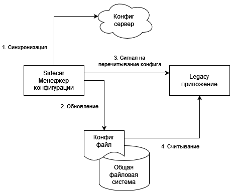

# Одноузловые паттерны проектирования
## Sidecar (прицеп)
Это одноузловой паттерн, состоящий из двух контейнеров.<br/>
Первый из них - *контейнер приложения*. Он содержит основную логику программы. Без этого контейнера приложения бы не существовало.<br/>
Помимо него предусмотрен еще *прицеп-контейнер* (sidecar). Роль прицепа - дополнить и улучшить контейнер приложения, часто таким образом, чтобы приложение не знало о его существовании.<br/>
Часто используется, чтобы добавить функциональности контейнеру, который было бы сложно улучшить другим способом.<br/>
<br/>
_Бёрнс Б., Распределенные системы. Паттерны проектирования. Стр. 34_

### Пример с добавлением HTTPS к старому компоненту, работающему на HTTP
<br/>
_Бёрнс Б., Распределенные системы. Паттерны проектирования. Стр. 36_

### Пример с чтением конфига из API и обновление конфиг-файла legacy-приложения
Прицеп запрашивает конфиг-сервер и при обнаружении отличий с текущим конфигом обновляет файл конфигурации и уведомляет legacy-приложение о необходимости перепрочитать конфиг<br/>
<br/>
_Бёрнс Б., Распределенные системы. Паттерны проектирования. Стр. 38_

### Пример с прицепом-мониторингом
Функциональность мониторинга (к примеру topz) можно развернуть в виде прицепа<br/>
_Бёрнс Б., Распределенные системы. Паттерны проектирования. Стр. 40_

### Вариант запуска контейнера-прицепа в том же пространстве идентификаторов
Нужно либо взять идентификатор контейнера после запуска
```shell
docker run -d <образ приложения>
```
Либо, выполнив `docker ps`<br/>
Далее нужно выполнить команду (если мы сохранили идентификатор в переменную среды `APP_ID`), на примере topz
```shell
docker run --pid=container:${APP_ID} \
  -p 8080:8080 \
  brendanburns/topz:db0fa58 /server -addr 0.0.0.0:8080
```
_Бёрнс Б., Распределенные системы. Паттерны проектирования. Стр. 41_