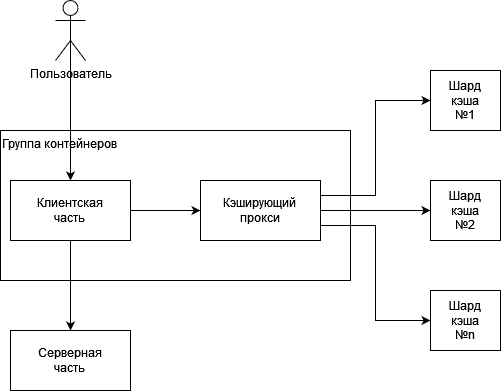

# Паттерны проектирования обслуживающих систем
## Реплицированные сервисы с распределением нагрузки
### Сервисы без внутреннего состояния
Сервисы без внутреннего состояния (stateless) не требуют для своей работы сохранения состояния. 
Системы не хранящие состояние, реплицируются для обеспечения избыточности и масштабируемости. 
Горизонтально масштабируемые системы поддерживают растущее количество пользователей путем добавления дополнительных копий сервиса 
При этом, балансировщик нагрузки не только равномерно распределяет нагрузку, но и предоставляет общее сетевое имя 
В кубернетес, балансировщик можно сделать с помощью объекта `Service` 
 
_Бёрнс Б., Распределенные системы. Паттерны проектирования. Стр. 82-83_

### Сервисы с закреплением сессии
Часто лучше обеспечить направление запроса конкретного пользователя определенному экземпляру сервиса 
Иногда это может быть обусловлено кешированием пользовательских данных 
Закрепление сессий обычно реализуется путем хеширования IP-адресов клиента и сервера  
 
_Бёрнс Б., Распределенные системы. Паттерны проектирования. Стр. 87-89_

### Кэширование
В простом виде, для http, кэширующий прокси представляет собой обычный HTTP-сервер, хранящий в памяти состояние запросов пользователей. 
Если два пользователя запросят одну и ту же web-страницу, только один запрос будет адресован приложению, а второй будет обслужен из памяти кэша. 
К примеру, если приложение выполняет сложную обработку, и визуализацию данных, нэш не помешает. 
Производительность кэша выражается в виде *коэффициента попадания запросов* - это доля запросов, ответ на которые содержится в кэше.  
Вариант релазиации - [varnish-cache](http://varnish-cache.org/) 
_Бёрнс Б., Распределенные системы. Паттерны проектирования. Стр. 90, 106_

## Шардированные сервисы
В отличие от реплицированных сервисов каждая *копия шардированного сервиса (шард)* может обслужить только часть запросов 
*Узаел балансировки нагрузки (корневой узел)* отвечает за изучение каждого запроса и перенаправление его соответствующему узлу (или узлам) для обработки 
Если репликация сервиса обычно используется для построения stateless-сервисов, то шардирование - для сервисов, хранящих состояние (stateful) 
_Бёрнс Б., Распределенные системы. Паттерны проектирования. Стр. 102_

### Пример шардирующего кэша
Это реализация кэша, стоящая между пользовательскими запросами и собственно распределенной реализацией кэша 
 
Поскольку конкретный пользователь или запрос всегда соответствуют одному и тому же шарду, в случае его отказа кэш-промахи будут приходить до тех пор, пока шард не будет восстановлен. 
Учитывая временность нахождения данных в кэше, такие кэш-промахи не являются проблемой сами по себе - система должна знать, где взять данные. Однако, на это время скорость будет снижена 
_Бёрнс Б., Распределенные системы. Паттерны проектирования. Стр. 105_

#### Шардированный и реплицированный кэш одновременно
Бывает, что система настолько зависима от кэша в плане нагрузки и задержек, что потеря даже одного шарда неприемлема 
Тогда можно применить шардирование с реплицированием шардов 
_Бёрнс Б., Распределенные системы. Паттерны проектирования. Стр. 107_

### Шардирующая функция
Задача шардирующей функции - определить соответствие между запросами и шардами 
`SHard = ShardingFunction(Req)` 
Шардирующая функция часто реализуется с помощью хэш-функции и оператора взятия остатка от деления 
_Бёрнс Б., Распределенные системы. Паттерны проектирования. Стр. 114_
