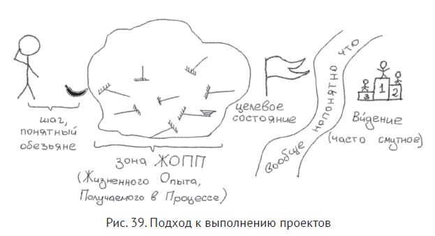

# Работа с проектами

## Основной подход к работе с проектами

1. Подумать над проектом и вычислить ближайшую задачу (см. правильные формулировки)
2. Записать задачу в список задач
3. Выполнить задачу
4. Вернуться к пункту №1

Не нужно сразу составлять план проекта.

Если план понятен - хорошо. Он будет справочной информацией.
Но в список задач нужны буквально одна-две задачи на ближайшие дни.
Жесткий план лишает маневренности.

*Дорофеев М. Джедайские техники. стр. 101*

## Определение первоочередных шагов методом волшебной феи

1. Представить результат проекта
   На что это будет похоже?
   Что вы будете чувствовать?
   Что вы будете делать с этим дальше?
2. Представить, что к вам прилетела маленькая волшебная фея и обещать прямо сейчас "вставить" в сегодняшний день 20 минут, что бы вы хоть чуточку приблизились к завершению этого проекта.
   Путь неэффективно, пусть радикально, но приблизились.
3. Пропустить мимо ушей первые возгласы обезьяны (которой этого времени хватит для всего проекта) и тараканов (которым требуется 3 часа только на то, чтобы сосредоточиться)
4. Сформулировать задачу и записать в общий список

*Дорофеев М. Джедайские техники. стр. 102-103*

## Метод рационального фланёра и подход Тойоты

<u>Рациональный фланёр</u> - это человек, который, в отличии от туриста, пересматривает свой маршрут на каждом шагу, чтобы сделать его зависимым 1от получения новой информации.

Применение метода в работе над проектом

1. признаем наличие неопределенности
2. при продвижении к завершению проекта, будет получена новая информация
3. на основе новой информации пересматриваем планы

*Дорофеев М. Джедайские техники. стр. 165*

## Подход Тойоты

1. В самом начале виденье не обязано быть четким (и уж точно не должно соответствовать SMART-у)
2. Определить ближайшее целевое состояние. Понятный промежуточный результат
3. Определить следующий конркетный шаг, приближающий к целевому состоянию, который можно добавить в список задач

*Дорофеев М. Джедайские техники. стр. 166*

## Метод минимального приемлемого результата

Похожий подход лежит в основе Agile-методологии, а в Lean он называется Minimal Viable Product.
Суть метода заключается в том, что ближайшее целевое состояние должно быть выбрано таким образом, что, даже если вдруг по его достижении проект будет завершен или принудительно закрыт, полученный результат все равно может быть использован.

Использовать просто: представьте, что послезавтра проекту конец. Или другой срок - поделите разумный срок на 10 или 20. Понятно, что при таких ограничениях не до красот.

*Дорофеев М. Джедайские техники. стр. 168-170*
